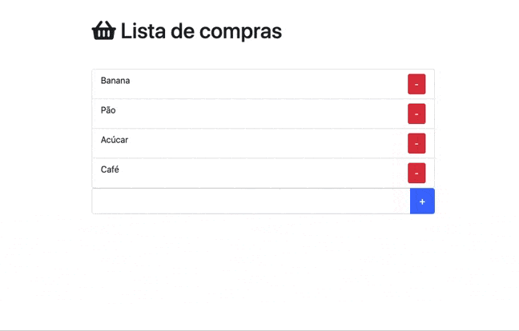

# MINILAB | DOM - Lista de compras

Neste minilab vamos praticar novamente o DOM, delegação de eventos e criação dinâmica de elementos

## Requerimentos

- Faça um fork deste repositório
- Clone este repositório

## Instruções

O objetivo do exercício é obter o seguinte resultado:

### Passo 1: HTML

Escreva o HTML necessário para obter uma tela parecida com a exemplificada acima. Não se preocupe tanto com estilos por enquanto, foque na funcionalidade. Seu HTML deve conter:

- Um input de texto
- Um botão

O HTML padrão já inclui alguns itens fixos na lista. Os novos itens criados dinamicamente devem possuir o mesmo HTML e CSS dos itens pré-definidos.

OBS.: O Bootstrap já está importado no arquivo HTML e seu uso é encorajado.

### Passo 2: Seletores

Use os seletores do DOM para selecionar as tags criadas acima no Javascript. Lembre-se sempre de dar nomes descritivos tanto para seus `ids` quanto para suas variáveis que receberão as referências das tags;

---

**Dica**

Você pode copiar e colar o `id` definido no HTML nos argumentos dos seus seletores para evitar erros de digitação

---

### Passo 3: Criando elementos

Crie um `listener` para o evento `click` no seu botão. Quando o botão for clicado, você deve extrair o conteúdo que foi escrito no input e criar um novo item na lista (`li`) cujo conteúdo será o texto digitado pelo usuário. Não se esqueça de adicionar o botão de remoção no novo item também!

### Passo 4: Removendo elementos

Crie um `listener` para o `click` em todos os botões de deleção (botões vermelhos com um "-") e remova o item da lista na mesma linha em que o botão foi clicado. Talvez o conceito de [Delegação de Eventos](https://desenvolvimentoparaweb.com/javascript/delegacao-de-evento-event-delegation-javascript/) possa ser útil aqui.

**Os itens pré-definidos também podem ser deletados!**

## Entrega

Quando terminar, copie e cole o link do seu repositório (basta copiar a URL atual do seu navegador) na unidade deste exercício no Student Portal (my.ironhack).
